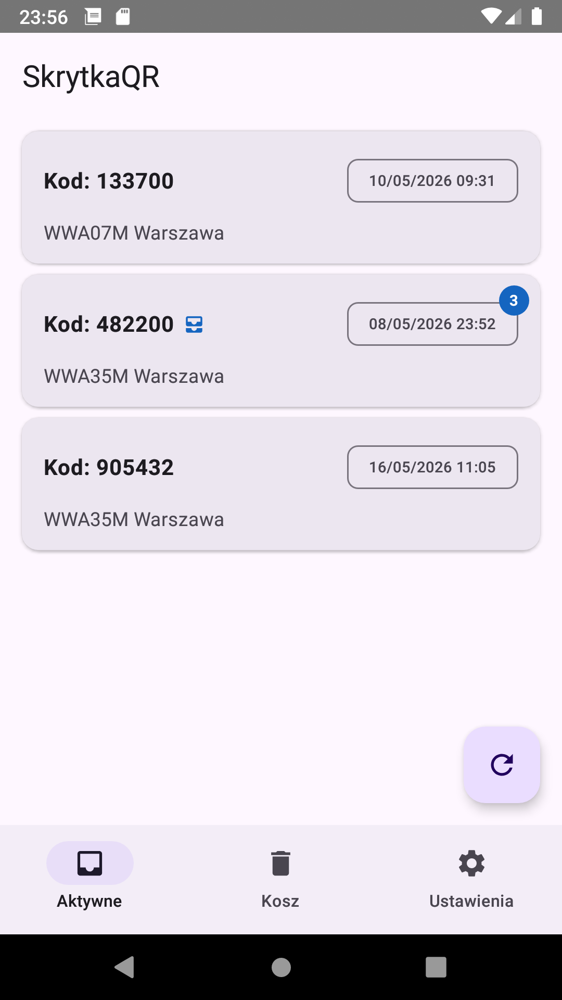
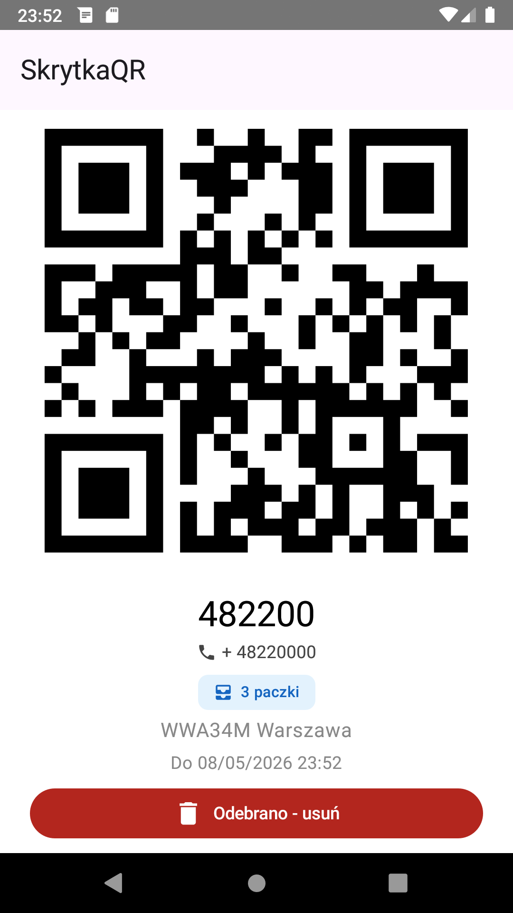

# SkrytkaQR

<p align="center">
  
  &nbsp;&nbsp;&nbsp;&nbsp;
  
</p>

Aplikacja służąca do odbioru paczek z paczkomatów InPost bez potrzeby dostępu do internetu.
Odczytuje kody odbioru z SMS-ów i MMS-ów,
następnie generuje gotowy kod QR do zeskanowania przy paczkomacie.

## Jak to działa

InPost wysyła SMS (czasami MMS) z kodem odbioru po dostarczeniu paczki do paczkomatu. Apka odczytuje te wiadomości, wyciąga kod następnie generuje QR w formacie akceptowanym przez paczkomat:

```
P|+4822000000|900729
```

Gdzie:
- `P` - Stały prefiks
- `+4822000000` - Twój numer telefonu (ustawiany w aplikacji)
- `900729` - Kod odbioru

## Wymagania

- Android 5.0 (API 21) lub nowszy

## Uprawnienia

| Uprawnienie | Powód |
|-------------|-------|
| `READ_SMS` | Odczyt SMS-ów i MMS-ów w celu wyciągnięcia kodu odbioru |

## Instalacja

### Android 13 i nowsze

Aplikacje instalowane spoza Google Play wymagają ręcznego odblokowania uprawnień. Po instalacji APK:

1. Wejdź w **Ustawienia → Aplikacje → Zobacz wszystkie aplikacje**
2. Znajdź **SkrytkaQR** na liście
3. Naciśnij **menu (trzy kropki)** w prawym górnym rogu
4. Wybierz **Zezwól na ustawienia z ograniczeniami**

Bez tego kroku aplikacja nie będzie mogła poprosić o dostęp do SMS-ów.

## Ustawienia zaawansowane

Aplikacja pozwala dostosować wyrażenia regularne do parsowania SMS-ów - przydatne jeśli InPost zmieni format wiadomości.

Domyślne wartości:
- **Kod odbioru:** `Kod odbioru:?\s*(\d{6})`
- **Warunek paczkomat:** `skrytce|skrytka|paczkomacie`

## Licencja

MIT